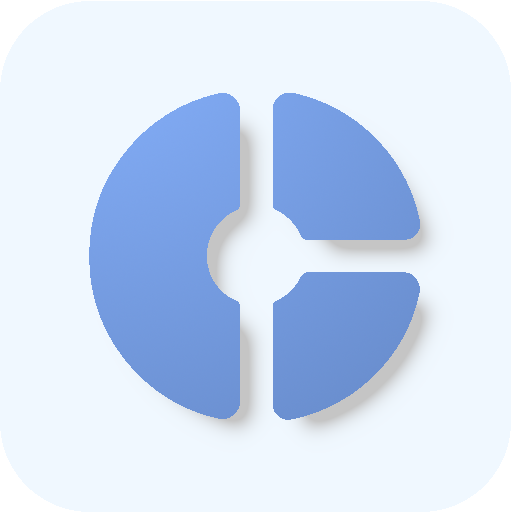

# Centsation

Centsation is the easy-to-use savings tracker that helps you reach your financial goals! Whether you're saving for a vacation, a new gadget, or an emergency fund, Centsation makes it simple and straightforward.

## Features

- Free and open source
- Material 3 design with support for dynamic colors
- Support for dark mode
- Supports for multiple currencies
- Archived savings
- Export and import to and from JSON
- History of transactions
- Sort by name, current saving or goal

## Screenshots

	

		
    
    
    
    
    
	

## License

This project is licensed under the GNU General Public License v3.0. See the
[LICENSE](LICENSE) file for details.
